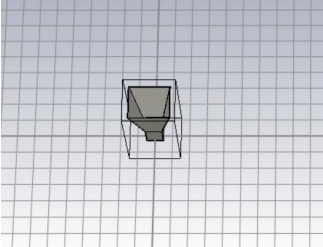
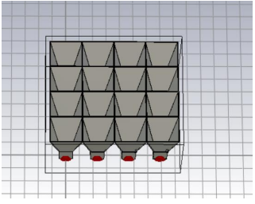
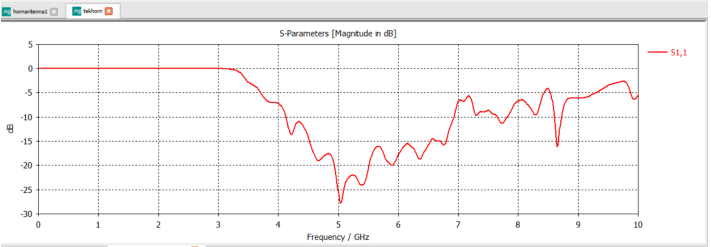
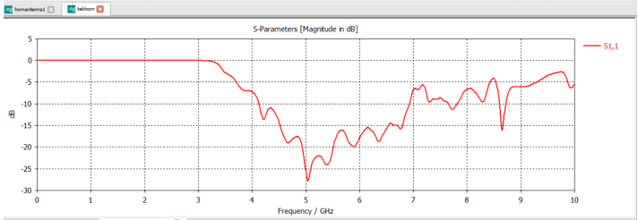
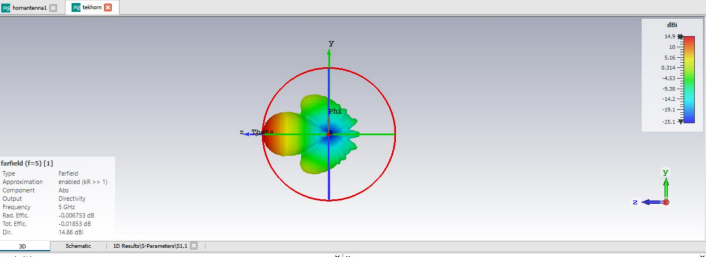
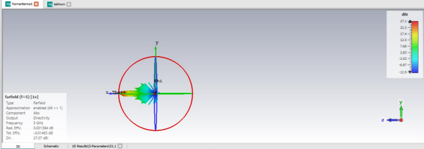

> EE-421 term project on the design and CST-based analysis of a 5 GHz pyramidal horn antenna and a 4x4 horn array.

# Design and Analysis of a Pyramidal Horn Antenna and 4x4 Horn Array at 5 GHz

This repository contains the design, simulation process, and results of an EE-421 term project focused on a 5 GHz pyramidal horn antenna and a 4x4 horn antenna array developed in CST Studio Suite.

## Project Overview

The aim of this project is to design a single pyramidal horn antenna operating at 5 GHz and compare its performance with a 4x4 horn array configuration. The study focuses on key antenna parameters such as reflection coefficient (S11), far-field radiation characteristics, and directivity.

The single horn antenna was modeled using a rectangular waveguide structure and excited with a probe-fed waveguide configuration. Then, the horn element was replicated to form a 4x4 planar array in order to investigate the directivity improvement obtained through arraying.

## Objectives

- Design a single pyramidal horn antenna for 5 GHz operation
- Model and simulate the antenna in CST Studio Suite
- Build a 4x4 horn antenna array using identical horn elements
- Compare the performance of the single horn and the array
- Evaluate S11, radiation pattern, and directivity
- Improve simulation efficiency using mesh optimization

## Software and Simulation Setup

- Software: CST Studio Suite
- Solver: Time Domain Solver
- Mesh Type: Hexahedral mesh
- Reference Impedance: 50 Ohm
- Material: Perfect Electric Conductor (PEC)
- Operating Frequency: 5 GHz

Far-field monitors were defined at 5 GHz to evaluate the radiation performance of both the single horn antenna and the 4x4 horn array.

## Antenna Design

### Single Horn Antenna

The antenna is a pyramidal horn antenna fed by a rectangular waveguide operating in the dominant TE10 mode. The horn expands in both the E-plane and H-plane, which improves impedance matching and enhances directivity.

The excitation was implemented using a metallic monopole probe inside the waveguide and a discrete edge port, providing a more realistic feeding method than an ideal waveguide port.

### 4x4 Horn Array

To increase directivity, the single horn antenna was replicated into a 4x4 planar array consisting of 16 identical horn elements.

Instead of explicitly modeling a physical corporate feed network, the array was excited under an ideal common feeding condition using CST's Combine Calculation Results feature. All elements were driven with equal amplitude and zero phase difference, corresponding to ideal broadside radiation.

## Mesh Optimization

During the initial simulations of the 4x4 horn array, the total mesh size exceeded 40 million cells, which caused long simulation times and high computational cost.

After mesh optimization, the total number of mesh cells was reduced to approximately 9 million, while preserving stable S11 characteristics and consistent far-field results. This significantly improved simulation efficiency without compromising the reliability of the results.

## Results

### Single Horn Antenna

- Good impedance matching around 5 GHz
- Maximum directivity: 14.86 dBi
- Stable and symmetric radiation pattern

### 4x4 Horn Array

- Similar S11 performance around 5 GHz
- Maximum directivity: 27.07 dBi
- Narrower main beam compared to the single horn antenna
- Approximate directivity improvement: 12 dB

The directivity increase is consistent with the theoretical gain expected from a coherent 16-element array:

10log10(16) ≈ 12 dB

## Conclusion

The results show that the 4x4 horn antenna array provides a significant improvement in directivity compared to the single horn antenna. While the single horn achieved 14.86 dBi, the array reached 27.07 dBi, confirming the expected benefit of increasing the effective radiating aperture.

This project also demonstrates the importance of mesh optimization in large electromagnetic simulations and shows that horn antenna arrays are strong candidates for high-gain microwave applications such as radar, satellite communications, and antenna measurement systems.

## Academic Context

This work was prepared as part of the EE-421 course in the Electrical and Electronic Engineering Department at Yeditepe University.

## Author

**Ali Buğra Bebek**  
Electrical and Electronic Engineering Student  
Yeditepe University

## Project Figures

### Single Horn Antenna Model

### 4x4 Horn Array Model

### Single Horn S11

### 4x4 Array S11

### Single Horn Far-Field Pattern

### 4x4 Array Far-Field Pattern

